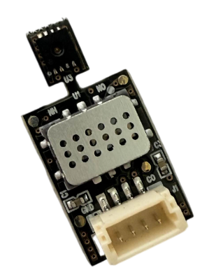
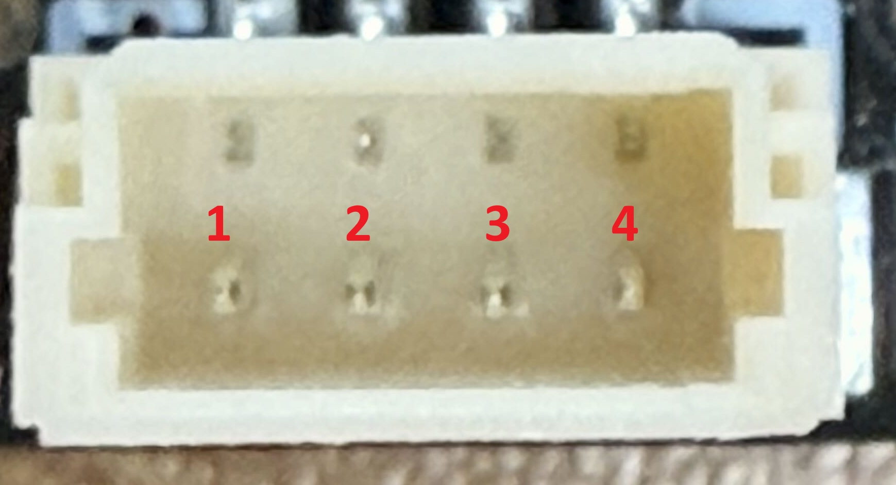

# Freshtech Air6814 Sensor Module Arduino Library

This is the Freshtech Air6814 library for Arduino allowing you to communicate with Air6814 over I2C.

## Sensor Information
Freshtech Air6814 is an atmospheric sensor module with SGX MiCS68184 and SHT30 sensor chips.
Using 3 MODs in MiCS6814, it measures multiple gas types. This library helps conversion of those raw values into ppm estimates.
MiCS6814 is communicates through ADC, which is connected in the same I2C bus as SHT30.

SHT30 can be called at the same time as MiCS6814 but due to the nature of how MiCS6814 works, the heat generated from it influences the reading of SHT30. (Typically adds ~20°C to the temperature reading and deducts ~30RH% to relative temperature readings.

| Sensor name | Readings | I²C Addresses |
|-------------|----------|-------------- |
|MiCS6814 (Through ADC)|NH3, CO, CH4, NO2| **0x48**|
|SHT30|Temperature(°C), Relative Humidity(RH%)| **0x44**|

## Installation of the library
This library can be installed using the PlatformIO Library manager:
Search `Air6814` in PlatformIO then add to your desired project,
or simply add `lib_deps = pisache/Air6814@^1.0.0` at the end of your `platformio.ini`

## Connect the sensor
Use the following pin description to connect your Air6814 to the standard I2C bus:

| *pin* | *Name* | *Description* |
|-------|:------:|---------------|
| 1 | GND | Ground |
| 2 | VDD | 5.0V |
| 3 | SCL | I2C: Serial Clock Input |
| 4 | SDA | I2C: Serial Data Input / Output |

## Quick Start
1. Install the library according to [Installation of the library](#installation-of-the-library)
2. Connect the Air6814 sensor module to your board as explained in [Connect the sensor](#connect-the-sensor)
3. Open the `Air6814Usage` sample project within your IDE:
   `File` ➔ `example` ➔ `Air6814Usage`
4. Click the `upload` button in the IDE
5. When the upload process has finished, open the `Serial Monitor` to monitor the readings. Note that the monitor speed is set to 115200.

## License
See [LICENSE](LICENSE).
